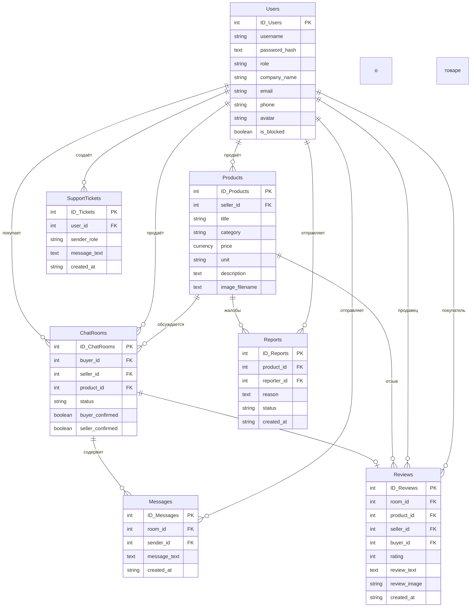

# Pole Market — ER-диаграмма базы данных

```mermaid
erDiagram
    Users ||--o{ Products : продаёт
    Users ||--o{ ChatRooms : покупает
    Users ||--o{ ChatRooms : продаёт
    Products ||--o{ ChatRooms : обсуждается
    ChatRooms ||--o{ Messages : содержит
    Users ||--o{ Messages : отправляет
    ChatRooms ||--o| Reviews : завершается
    Products ||--o{ Reviews : отзыв о товаре
    Users ||--o{ Reviews : продавец
    Users ||--o{ Reviews : покупатель
    Products ||--o{ Reports : жалобы
    Users ||--o{ Reports : отправляет
    Users ||--o{ SupportTickets : создаёт

    Users {
        int ID_Users PK
        string username
        text password_hash
        string role
        string company_name
        string email
        string phone
        string avatar
        boolean is_blocked
    }

    Products {
        int ID_Products PK
        int seller_id FK
        string title
        string category
        currency price
        string unit
        text description
        text image_filename
    }

    ChatRooms {
        int ID_ChatRooms PK
        int buyer_id FK
        int seller_id FK
        int product_id FK
        string status
        boolean buyer_confirmed
        boolean seller_confirmed
    }

    Messages {
        int ID_Messages PK
        int room_id FK
        int sender_id FK
        text message_text
        string created_at
    }

    Reviews {
        int ID_Reviews PK
        int room_id FK
        int product_id FK
        int seller_id FK
        int buyer_id FK
        int rating
        text review_text
        string review_image
        string created_at
    }

    Reports {
        int ID_Reports PK
        int product_id FK
        int reporter_id FK
        text reason
        string status
        string created_at
    }

    SupportTickets {
        int ID_Tickets PK
        int user_id FK
        string sender_role
        text message_text
        string created_at
    }
```
